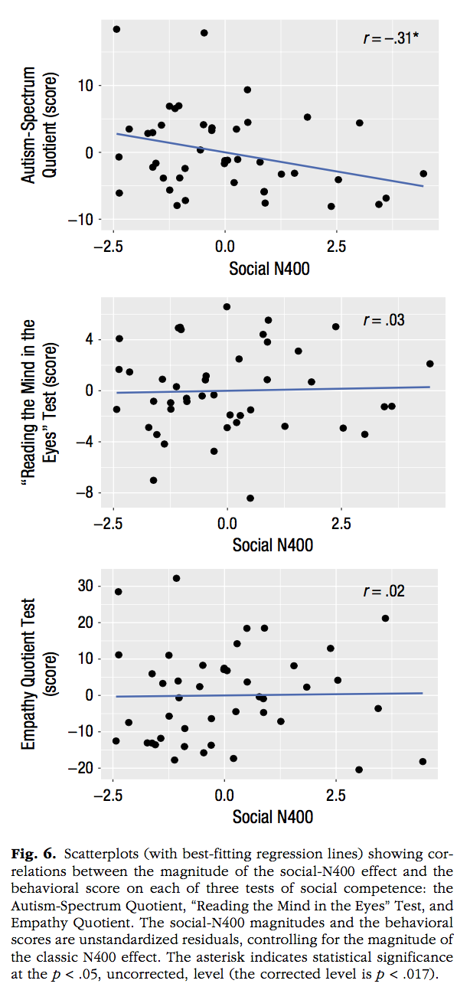
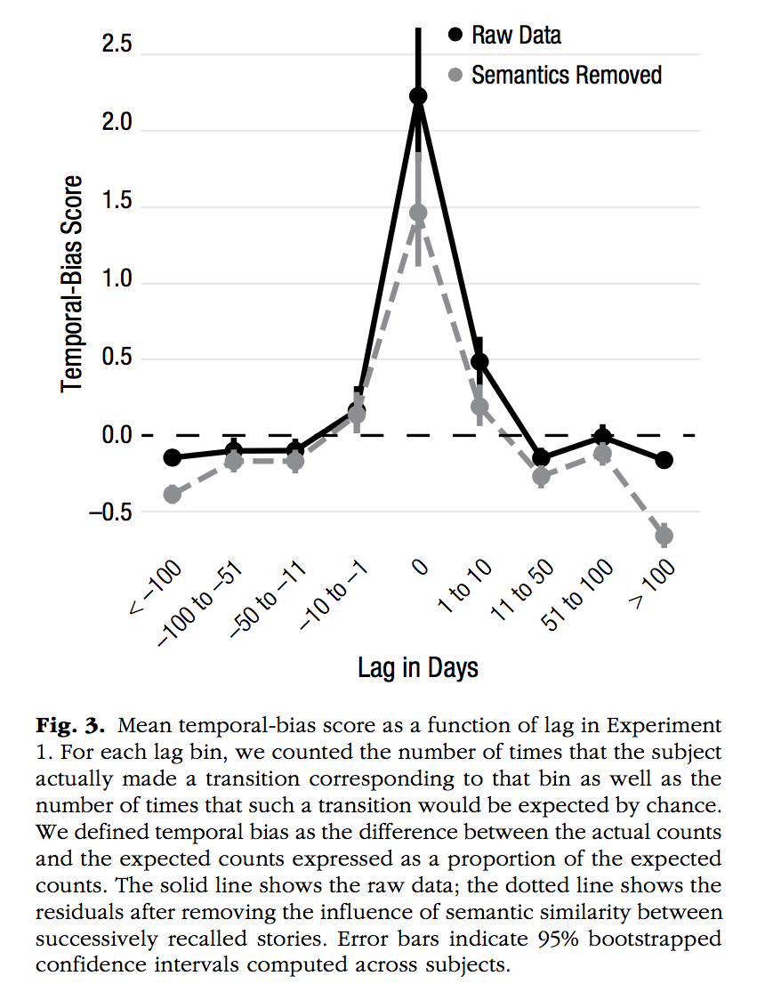

```{r setup, include=FALSE}
knitr::opts_chunk$set(echo = TRUE)
```

See the example code at the end of this document for more examples of working ggplot2 scripts.

## Data-vis assignment

This assignment contains several figures that were recently published in the January 2019 issue of Psychological Science. Although, this sample of figures is somewhat arbitrary, they represent a decent range of figures that are produced in Psychological research. Notably, the look and feel of these graphs suggests that that they were all made in R using the ggplot2 package. And even if they weren't, they can all be made in ggplot2.

Your task is to write code to reproduce each of the graphs using ggplot2. You do not have the original data for any of these graphs, and your job is to make inferences about what the data must have been. For each graph you will create a data.frame to mimic the data you see in the graph, and then use ggplot2 to make the plot. 

By the end of this exercise you will become much more familiar with how ggplot2 works, and you will have created several examples of working ggplot2 scripts that you can use for making graphs in the future.

## List of Figures to reproduce


Calcutt, S. E., Proctor, D., & Berman, S. M. (2019). Chimpanzees (Pan troglodytes) Are More Averse to Social Than Nonsocial Risk. Psychological Science, 30, 105–115.

```{r, echo=FALSE}
library(ggplot2)
library(ggrepel)
knitr::include_graphics("datavis_figs/Calcutt1.png")

chimps<-rep(c("Dara","Rita","Liza","Katie","Azalea","Barbi","Rowena","Fiona"), each=2)
MF <- c(59,60,51,57,48,33,3,4,23,43,1,42,3,38,0,10)
Condition <- rep(c("Social Condition","Nonsocial Condition"),8)
Aversity <- rep(c("Not Averse","Averse"),each=8)

plot_df <- data.frame(chimps,
                      MF,
                      Condition,
                      Aversity,
                      chimps2=chimps)

plot_df$chimps2[c(2,4,6,8,9,11,13,15)]<-""

plot_df$Condition <- factor(plot_df$Condition, levels = c("Social Condition","Nonsocial Condition"))


#note the commented code shows an example of using text repel to make the labels non overlapping.

ggplot(plot_df, aes(x=Condition, 
                    y=MF, 
                    linetype=Aversity,
                    group=chimps,
                    label=chimps2))+
  geom_line()+
  theme_classic(base_size=12)+
  xlab("")+
  ylab("Mean Frequency of Risky Choice")+
  theme(legend.position="none") +
  #geom_text_repel(size=3,aes(label=chimps2))+
  annotate("text", x = .8, y = 60, label = "Dara")+
  annotate("text", x = .8, y = 53, label = "Rita")+
  annotate("text", x = .8, y = 47, label = "Liza")+
  annotate("text", x = .8, y = 3, label = "Katie")+
  annotate("text", x = 2.2, y = 45, label = "Azalea")+
  annotate("text", x = 2.2, y = 41, label = "Barbi")+
  annotate("text", x = 2.2, y = 35, label = "Rowena")+
  annotate("text", x = 2.2, y = 10, label = "Fiona")
```

```{r, echo=FALSE, fig.width=2, fig.height=2}
knitr::include_graphics("datavis_figs/Calcutt2.png")

NS_risk<-c(0,1,3,4,25,45,52,59)
S_risk<-c(12,47,4,41,48,35,55,60)
plot_df<-data.frame(NS_risk,S_risk)

ggplot(plot_df, aes(x=NS_risk,y=S_risk))+
  geom_point(shape=18, fill="black")+
  geom_smooth(method="lm",se=FALSE, color="black")+
  theme_classic(base_size=12)+
  xlab("Average Frequency of Nonsocial Risk")+
  ylab("Average Frequency of Social Risk")+
  coord_cartesian(xlim=c(0,70), ylim=c(0,70))+
  scale_x_continuous(breaks=seq(0,70,10), expand=c(0,0))+
  scale_y_continuous(breaks=seq(0,70,10), expand=c(0,0))
  
  

```


Cao, J., Kleiman-Weiner, M., & Banaji, M. R. (2019). People Make the Same Bayesian Judgment They Criticize in Others. Psychological Science, 30, 20–31.

```{r, echo=FALSE}
knitr::include_graphics("datavis_figs/Cao1.png")
```

```{r, echo=FALSE}
knitr::include_graphics("datavis_figs/Cao2.png")
```

```{r, echo=FALSE}
knitr::include_graphics("datavis_figs/Cao3.png")
```

```{r, echo=FALSE}
knitr::include_graphics("datavis_figs/Cao4.png")
```


Jefferies, L. N., & Lollo, V. D. (2019). Sudden Events Change Old Visual Objects Into New Ones: A Possible Role for Phasic Activation of Locus Coeruleus. Psychological Science, 30, 55–64.

```{r, echo=FALSE}
knitr::include_graphics("datavis_figs/Jeffries1.png")
```

Jouravlev, O., Schwartz, R., Ayyash, D., Mineroff, Z., Gibson, E., & Fedorenko, E. (2019). Tracking Colisteners’ Knowledge States During Language Comprehension. Psychological Science, 30, 3–19.

```{r, echo=FALSE}

```


Kim, H., Domenico, S. I. D., & Connelly, B. S. (2019). Self–Other Agreement in Personality Reports: A Meta-Analytic Comparison of Self- and Informant-Report Means. Psychological Science, 30, 129–138.

```{r, echo=FALSE}
knitr::include_graphics("datavis_figs/Kim1.png")
```


Oh, D., Buck, E. A., & Todorov, A. (2019). Revealing Hidden Gender Biases in Competence Impressions of Faces. Psychological Science, 30, 65–79.

```{r, echo=FALSE}
knitr::include_graphics("datavis_figs/Oh1.png")
```

Perfecto, H., Donnelly, K., & Critcher, C. R. (2019). Volume Estimation Through Mental Simulation. Psychological Science, 30, 80–91.

```{r, echo=FALSE}
knitr::include_graphics("datavis_figs/Perfecto1.png")
```

```{r, echo=FALSE}
knitr::include_graphics("datavis_figs/Perfecto2.png")
```

Smith, S. M., & Krajbich, I. (2019). Gaze Amplifies Value in Decision Making. Psychological Science, 30, 116–128.

```{r, echo=FALSE}
knitr::include_graphics("datavis_figs/Smith1.png")
```

Uitvlugt, M. G., & Healey, M. K. (2019). Temporal Proximity Links Unrelated News Events in Memory. Psychological Science, 30, 92–104.

```{r, echo=FALSE}

```


## Checklist of ggplot2 skills

If you are confident that you can accomplish the items below, then you are well on your way to becoming proficient in ggplot2.

### Making graphs

1. Make a scatterplot between an x an y variable
  - add a regression line to plot
2. Make a bar graph
  - for one factor with multiple levels
  - for two factors, each with multiple levels
  - for three or more factors (using facet_wrap)
3. Make a line graph
  - for one factor with multiple levels
  - for two factors, each with multiple levels
  - for three or more factors (using facet_wrap)
4. Add error bars to bar or line graph
5. Make a histogram

### Customizing graphs

1. Edit title
2. Edit y-axis label
3. Edit x-axis label
4. Change theme (e.g., theme_classic)
5. Change size of figure (width, height)
6. Change y-axis range
7. re-order categorical factor levels

## Example code

### Data frames

Many libraries and functions in R use data.frames. As you will discover throughout the course, a common workflow will be to

1. Get the data into R, then make it into a data.frame
2. Manipulate the data.frame so it contains the information you want (this is the topic of data wrangling we cover next week)
2. Use the data.frame as input to another function (to make a graph, or run an analysis)

The bottom line is that once you format the data using a data.frame, many things become immediately possible without having to further reformat the data

A data frame is like a table, it can have named columns and rows. 

```{r}


```


Make sure you load ggplot2 before you try to use it  in your rmd file.

```{r}
library(ggplot2)
```


### Scatterplot

```{r}
# Create dataframe
a <- c(1,2,3,2,3,4,5,4)
b <- c(4,3,4,3,2,1,2,3)
plot_df <- data.frame(a,b)

# basic scatterplot
ggplot(plot_df, aes(x=a,y=b))+
  geom_point()

# customize, add regression line
ggplot(plot_df, aes(x=a,y=b))+
  geom_point(size=2)+
  geom_smooth(method=lm)+
  coord_cartesian(xlim=c(0,7),ylim=c(0,10))+
  xlab("x-axis label")+
  ylab("y-axis label")+
  ggtitle("I made a scatterplot")+
  theme_classic(base_size=12)+
  theme(plot.title = element_text(hjust = 0.5))

```

### bar graph

1 factor

```{r}
#Create a dataframe
factor_one <- as.factor(c("A","B","C"))
dv_means <- c(20,30,40)
dv_SEs   <- c(4,3.4,4)
plot_df <- data.frame(factor_one,
                      dv_means,
                      dv_SEs)

# basic bar graph

ggplot(plot_df, aes(x=factor_one,y=dv_means))+
  geom_bar(stat="identity")

# adding error bars, customizing

ggplot(plot_df, aes(x=factor_one,y=dv_means))+
  geom_bar(stat="identity")+
  geom_errorbar(aes(ymin=dv_means-dv_SEs,
                    ymax=dv_means+dv_SEs),
                width=.2)+
  coord_cartesian(ylim=c(0,100))+
  xlab("x-axis label")+
  ylab("y-axis label")+
  ggtitle("I made a bar graph")+
  theme_classic(base_size=12)+
  theme(plot.title = element_text(hjust = 0.5))
  
```

2 factor

```{r}
#Create a dataframe
factor_one <- rep(as.factor(c("A","B","C")),2)
factor_two <- rep(as.factor(c("IIA","IIB")),3)
dv_means <- c(20,30,40,20,40,40)
dv_SEs   <- c(4,3.4,4,3,2,4)
plot_df <- data.frame(factor_one,
                      factor_two,
                      dv_means,
                      dv_SEs)

# basic bar graph

ggplot(plot_df, aes(x=factor_one,y=dv_means,
                    group=factor_two,
                    color=factor_two))+
  geom_bar(stat="identity", position="dodge")

# adding error bars, customizing

ggplot(plot_df, aes(x=factor_one,y=dv_means,
                    group=factor_two,
                    color=factor_two,
                    fill=factor_two))+
  geom_bar(stat="identity", position="dodge")+
  geom_errorbar(aes(ymin=dv_means-dv_SEs,
                    ymax=dv_means+dv_SEs),
                position=position_dodge(width=0.9),
                width=.2,
                color="black")+
  coord_cartesian(ylim=c(0,100))+
  xlab("x-axis label")+
  ylab("y-axis label")+
  ggtitle("Bar graph 2 factors")+
  theme_classic(base_size=12)+
  theme(plot.title = element_text(hjust = 0.5))
  
```

3 factor

```{r}
#Create a dataframe
factor_one <- rep(rep(as.factor(c("A","B","C")),2),2)
factor_two <- rep(rep(as.factor(c("IIA","IIB")),3),2)
factor_three <- rep(as.factor(c("IIIA","IIIB")),each=6)
dv_means <- c(20,30,40,20,40,40,
              10,20,50,50,10,10)
dv_SEs   <- c(4,3.4,4,3,2,4,
              1,2,1,2,3,2)
plot_df <- data.frame(factor_one,
                      factor_two,
                      factor_three,
                      dv_means,
                      dv_SEs)

# basic bar graph

ggplot(plot_df, aes(x=factor_one,y=dv_means,
                    group=factor_two,
                    color=factor_two))+
  geom_bar(stat="identity", position="dodge")+
  facet_wrap(~factor_three)

```

### Line Graph

1 factor

```{r}
#Create a dataframe
factor_one <- as.factor(c("A","B","C"))
dv_means <- c(20,30,40)
dv_SEs   <- c(4,3.4,4)
plot_df <- data.frame(factor_one,
                      dv_means,
                      dv_SEs)

# basic line graph

ggplot(plot_df, aes(x=factor_one,y=dv_means, group=1))+
  geom_point()+
  geom_line()

# adding error bars, customizing

ggplot(plot_df, aes(x=factor_one,y=dv_means, group=1))+
  geom_point()+
  geom_line()+
  geom_errorbar(aes(ymin=dv_means-dv_SEs,
                    ymax=dv_means+dv_SEs),
                width=.2)+
  coord_cartesian(ylim=c(0,100))+
  xlab("x-axis label")+
  ylab("y-axis label")+
  ggtitle("I made a line graph")+
  theme_classic(base_size=12)+
  theme(plot.title = element_text(hjust = 0.5))

```

2 factor

```{r}
#Create a dataframe
factor_one <- rep(as.factor(c("A","B","C")),2)
factor_two <- rep(as.factor(c("IIA","IIB")),3)
dv_means <- c(20,30,40,20,40,40)
dv_SEs   <- c(4,3.4,4,3,2,4)
plot_df <- data.frame(factor_one,
                      factor_two,
                      dv_means,
                      dv_SEs)

# basic line graph

ggplot(plot_df, aes(x=factor_one,y=dv_means,
                    group=factor_two,
                    color=factor_two,
                    linetype=factor_two))+
  geom_point()+
  geom_line()
```


### Histogram

base R
```{r}
a<-rnorm(100,0,1)
hist(a)
```

```{r}
score <- rnorm(100,0,1)
n <- 1:100
plot_df <- data.frame(score,n)

ggplot(plot_df, aes(x=score))+
  geom_histogram(bins=10,
                 color="white")

```


