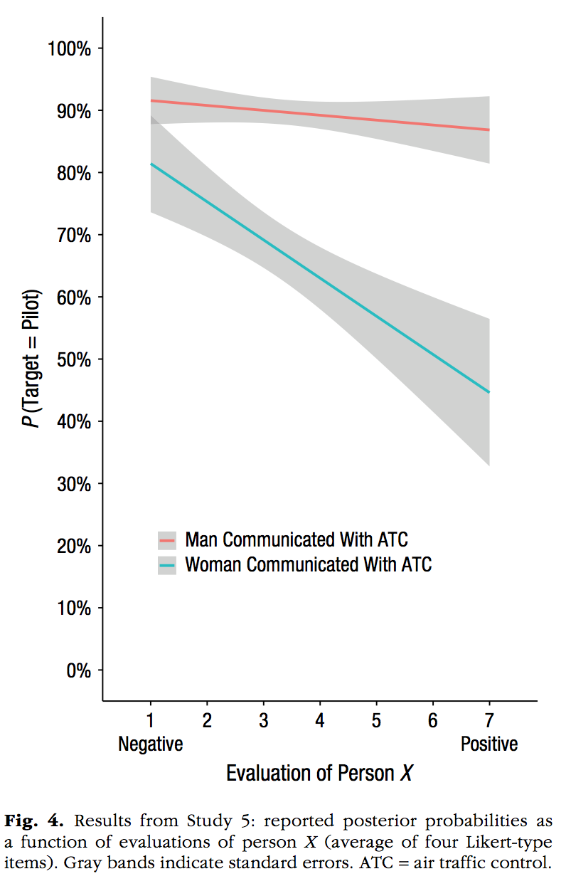

```{r setup, include=FALSE}
knitr::opts_chunk$set(echo = TRUE, cache=TRUE, warning=FALSE)
```

See the example code at the end of this document for more examples of working ggplot2 scripts.

## Data-vis assignment solutions

This assignment contains several figures that were recently published in the January 2019 issue of Psychological Science. Although, this sample of figures is somewhat arbitrary, they represent a decent range of figures that are produced in Psychological research. Notably, the look and feel of these graphs suggests that that they were all made in R using the ggplot2 package. And even if they weren't, they can all be made in ggplot2.

Your task is to write code to reproduce each of the graphs using ggplot2. You do not have the original data for any of these graphs, and your job is to make inferences about what the data must have been. For each graph you will create a data.frame to mimic the data you see in the graph, and then use ggplot2 to make the plot. 

By the end of this exercise you will become much more familiar with how ggplot2 works, and you will have created several examples of working ggplot2 scripts that you can use for making graphs in the future.

## List of Figures to reproduce


Calcutt, S. E., Proctor, D., & Berman, S. M. (2019). Chimpanzees (Pan troglodytes) Are More Averse to Social Than Nonsocial Risk. Psychological Science, 30, 105–115.

```{r, echo=FALSE}
knitr::include_graphics("datavis_figs/Calcutt1.png")
```


```{r, fig.height=4, fig.width=4}
library(ggplot2)
library(ggrepel)

chimps<-rep(c("Dara","Rita","Liza","Katie","Azalea","Barbi","Rowena","Fiona"), each=2)
MF <- c(59,60,51,57,48,33,3,4,23,43,1,42,3,38,0,10)
Condition <- rep(c("Social Condition","Nonsocial Condition"),8)
Aversity <- rep(c("Not Averse","Averse"),each=8)

plot_df <- data.frame(chimps,
                      MF,
                      Condition,
                      Aversity,
                      chimps2=chimps)

plot_df$chimps2[c(2,4,6,8,9,11,13,15)]<-""

plot_df$Condition <- factor(plot_df$Condition, levels = c("Social Condition","Nonsocial Condition"))


#note the commented code shows an example of using text repel to make the labels non overlapping.

ggplot(plot_df, aes(x=Condition, 
                    y=MF, 
                    linetype=Aversity,
                    group=chimps,
                    label=chimps2))+
  geom_line()+
  theme_classic(base_size=13)+
  xlab("")+
  ylab("Mean Frequency of Risky Choice")+
  theme(legend.position="none") +
  scale_y_continuous(breaks=seq(0,70,10), expand=c(0,0))+
  coord_cartesian(ylim=c(0,70))+
  #geom_text_repel(size=3,aes(label=chimps2))+
  annotate("text", x = .8, y = 60, label = "Dara")+
  annotate("text", x = .8, y = 53, label = "Rita")+
  annotate("text", x = .8, y = 47, label = "Liza")+
  annotate("text", x = .8, y = 3, label = "Katie")+
  annotate("text", x = 2.2, y = 45, label = "Azalea")+
  annotate("text", x = 2.2, y = 41, label = "Barbi")+
  annotate("text", x = 2.2, y = 35, label = "Rowena")+
  annotate("text", x = 2.2, y = 10, label = "Fiona")
```


-----

```{r, echo=FALSE,fig.width=2, fig.height=2}


```

**Notes**

1. Psychological Science has a style guide that asks authors to use the font: Helvetica Neue 57 Condensed roman font

2. I installed that font on machine (found a free .ttf download), then used the `showtext` library to use that font with ggplot2. **warning: this won't work if you don't have the font installed, and installing the font could be idiosyncratic, it took me at least an hour**

```{r, fig.width=2, fig.height=2}
library(showtext)

font_add("HelveticaNeue",
    regular = "/Users/mattcrump/Library/Fonts/Helvetica-Neue-LT-Std-57-Condensed_22529.ttf")
## Automatically use showtext to render plots
showtext_auto()

NS_risk<-c(0,1,3,4,25,45,52,59)
S_risk<-c(12,47,4,41,48,35,55,60)
plot_df<-data.frame(NS_risk,S_risk)

p<-ggplot(plot_df, aes(x=NS_risk,y=S_risk))+
  geom_point(shape=18, size=1,fill="black")+
  geom_smooth(method="lm",se=FALSE, color="black", size=.35)+
 # theme_classic(base_size=12, base_family = "Arial Narrow")+
  theme(axis.title.x=element_text(size=12,family="HelveticaNeue"),
        axis.title.y=element_text(size=12, 
                                  family="HelveticaNeue"),
        axis.text =element_text(size=11, 
                                  family="HelveticaNeue",
                                  color="black"),
        panel.grid.major = element_blank(),
        panel.grid.minor = element_blank(),
        panel.background = element_blank())+
  xlab("Average Frequency of Nonsocial Risk")+
  ylab("Average Frequency of Social Risk")+
  coord_cartesian(xlim=c(0,70), ylim=c(0,70))+
  scale_x_continuous(breaks=seq(0,70,10), expand=c(0,0))+
  scale_y_continuous(breaks=seq(0,70,10), expand=c(0,0))+
  theme(axis.line = element_line(size = .25))+
  theme(axis.ticks = element_line(size = .25))

ggsave("datavis_figs/Calcutt2_Crump.png", p, width = 3, height = 3)


```


Cao, J., Kleiman-Weiner, M., & Banaji, M. R. (2019). People Make the Same Bayesian Judgment They Criticize in Others. Psychological Science, 30, 20–31.

```{r, echo=FALSE}
knitr::include_graphics("datavis_figs/Cao1.png")
```

**Notes**
1. ggplot automatically orders factor levels alphabetically, this examples shows a method to rearrange the order of factor levels in the data.frame before plotting

```{r, fig.height=3, fig.width=4.7}
studies <- rep(c("Doctor \n Study 1 \n N = 199",
             "Butcher \n Study 2 \n n = 199",
             "Firefighter \n Study 2 \n n = 200",
             "Construction \n Worker \n Study 2 \n n = 205"), each=3)
likely <- rep(c("Women More Likely",
            "Equally Likely",
            "Man more Likely"),4)

pp <- c(0,90,10,
        5,60,35,
        2,40,58,
        5,60,35)/100

plot_df <- data.frame(pp,studies,likely)

plot_df$likely <- factor(plot_df$likely, 
                         levels = c("Women More Likely",
                                    "Equally Likely",
                                    "Man more Likely"))

plot_df$studies <- factor(plot_df$studies, 
                         levels = c("Doctor \n Study 1 \n N = 199",
             "Butcher \n Study 2 \n n = 199",
             "Firefighter \n Study 2 \n n = 200",
             "Construction \n Worker \n Study 2 \n n = 205"))

ggplot(plot_df, aes(x=studies,
                    y=pp,
                    group=likely,
                    fill=likely))+
  geom_bar(stat="identity", width=.5)+
  theme_classic(base_size=10)+
  xlab("")+
  ylab("Percentage of Participants")+
  scale_y_continuous(breaks=seq(0,1,.1),labels = scales::percent)+
  theme(legend.title = element_blank(),
        axis.ticks.x.bottom = element_blank())


```

**Notes**
1. An example of violin plots, which require distributions of numbers for each level
2. An example of using two data.frames in ggplot, one with all of the raw data for each level, and another with the means and confidence intervals. Confidence intervals are computed using the t.test function

```{r, fig.height=3.5, fig.width=3.5}
A <- rexp(200)
B <- rnorm(200,3,sd=1)
C <- rnorm(200,3,sd=1)
D <- rnorm(200,3,sd=1)
DV <- c(A,B,C,D)
studies <- rep(c("Doctor \n Study 1 \n N = 199",
             "Butcher \n Study 2 \n n = 199",
             "Firefighter \n Study 2 \n n = 200",
             "Construction \n Worker \n Study 2 \n n = 205"), each=200)

plot_df <-data.frame(DV,studies)

plot_df$studies <- factor(plot_df$studies, 
                         levels = c("Doctor \n Study 1 \n N = 199",
             "Butcher \n Study 2 \n n = 199",
             "Firefighter \n Study 2 \n n = 200",
             "Construction \n Worker \n Study 2 \n n = 205"))

library(dplyr)
means_df <- plot_df %>%
              group_by(studies) %>%
              summarise(M=mean(DV),
                        CI_lower = t.test(DV)$conf.int[1],
                        CI_upper = t.test(DV)$conf.int[2])

ggplot(means_df, aes(x=studies,y=M))+
  geom_violin(data=plot_df, aes(x=studies,y=DV),fill="grey")+
  theme_classic(base_size=10)+
  xlab("")+
  ylab("Evaluation of Person X")+
  scale_y_continuous(breaks=seq(0,7,1))+
  coord_cartesian(ylim=c(0,7))+
  geom_point()+
  geom_errorbar(aes(ymin=CI_lower,ymax=CI_upper), width=.2)
```


```{r, echo=FALSE}
knitr::include_graphics("datavis_figs/Cao2.png")
```

```{r, echo=FALSE}
knitr::include_graphics("datavis_figs/Cao3.png")
```

**Notes:**
1. An example of a histogram. Note this is incomplete because the y-axis is not showing percentages...

```{r, fig.width=2.5,fig.height=2.5}
ps <- rnorm(100,0,1)
s<-1:100
plot_df<-data.frame(s,ps)

ggplot(plot_df, aes(x=ps))+
  geom_histogram(fill="green",
                 color="black")+
  coord_cartesian(xlim=c(-4,4))+
  theme_classic(base_size=9)+
  xlab("Log Likelihood Ratio")+
  ylab("Participants (in Each condition)")+
  ggtitle("Women Performed Surgery")+
  geom_vline(xintercept=0,linetype=2)

```

**Notes:**
1. customizes color schemes by hard-coding
2. use facet_wrap, and take away the borders of the facet titles

```{r, fig.width=4,fig.height=5}
Gender <- rep(c("Men Performed Surgery \n n = 152",
            "Women Performed Surgery \n n = 142"), each =3)
Parameter <- rep(c("Prior",
               "Model \n Posterior",
               "Reported \n Posterior"), 2)
p <- c(.7, .88, .87, .29, .72, .76)
ci <- c(.05, .05, .05, .05, .05, .05)
plot_df <- data.frame(p, ci, Gender, Parameter)
plot_df$Parameter <- factor(plot_df$Parameter, 
                         levels = c("Prior",
               "Model \n Posterior",
               "Reported \n Posterior"))

ggplot(plot_df, aes(x=Parameter, y=p, fill=Parameter))+
  geom_bar(stat="identity", position="dodge")+
  facet_wrap(~Gender)+
  theme_classic(base_size=11)+
  scale_fill_manual(values=c("#F8766D", "#7CAE00", "#C77CFF"))+
  ylab("P(Target = Doctor)")+
  scale_y_continuous(breaks=seq(0,1,.1),labels = scales::percent)+
  coord_cartesian(ylim=c(0,1))+
  theme(panel.grid = element_blank(),
        panel.spacing.x = unit(0,"line"),
        panel.border = element_blank(),
        panel.background = element_blank())+
  theme(strip.background = element_rect(colour = 'white', fill = 'white', size = 0))+
  theme(legend.position = "none")


```


```{r, echo=FALSE}

```


**Notes:**
1. two linear regression lines using `geom_smooth(method="lm")`
2. The raw data is not plotted as points

```{r, fig.width=3.5, fig.height=4}
evaluation<-c((seq(1,7,.1)+runif(61,-2,2)),
              (seq(1,7,.1)+runif(61,-2,2)))
pTarget <-c((seq(.92,.85,length.out=61)+runif(61,-.1,.1)),
            (seq(.8,.4,length.out=61)+runif(61,-.5,.5)))
Gender <- rep(c("Man Communicated with ATC",
            "Woman Communicated with ATC"), each=61)
plot_df<-data.frame(evaluation,pTarget,Gender)
plot_df <- plot_df %>%
              filter(evaluation>=1,
                     evaluation<=7)

ggplot(plot_df, aes(x=evaluation,y=pTarget,
                    group=Gender,
                    color=Gender))+
  geom_smooth(method="lm")+
  theme_classic()+
  scale_y_continuous(breaks=seq(0,1,.1),labels = scales::percent)+
  scale_x_continuous(breaks=seq(1,7,1))+
  coord_cartesian(ylim=c(0,1))+
  xlab("Evaluation of Person X")+
  ylab("P(Target = Pilot)")+
  theme(legend.position=c(0.45,0.2),
        legend.title=element_blank(),
        legend.key.size = unit(.5, "cm"))+
  theme(legend.key = element_rect(colour = 'white', fill = 'white', size = 1, linetype='solid'))

```


Jefferies, L. N., & Lollo, V. D. (2019). Sudden Events Change Old Visual Objects Into New Ones: A Possible Role for Phasic Activation of Locus Coeruleus. Psychological Science, 30, 55–64.

```{r, echo=FALSE}

```

**Notes:**
1. Example of using the `ggpubr` package and the `ggarrange` function to put two separate plots side-by-side in a 2-column, 1-row, grid.

```{r, fig.width=5}
library(ggpubr)

Condition <-rep(c("No \n Transient","Transient"), each=2)
Location <-rep(c("Outside","Inside"),2)
MMRT <- c(304,300,290,280)
CI_upper <-c(315,310,304,290)
CI_lower <-c(295,290,283,270)
plot_df <-data.frame(Condition,Location,MMRT,CI_upper,CI_lower)
plot_df$Location <- factor(plot_df$Location, 
                         levels = c("Outside","Inside"))

vis<-ggplot(plot_df, aes(x=Condition, y=MMRT, group=Location,
                    fill=Location))+
  geom_bar(stat="identity",position="dodge", 
           color="black",
           size=.25)+
  theme_classic()+
  ylab("Mean Median RT (ms)")+
  coord_cartesian(ylim=c(230,340))+
  scale_y_continuous(breaks=seq(230,340,10))+
  scale_fill_brewer(palette="Greys", direction=-1)+
   theme(legend.position=c(0.55,0.8),
        legend.title=element_blank(),
        legend.key.size = unit(.5, "cm"))+
  ggtitle("Visual Group")

Condition <-rep(c("No \n Transient","Transient"), each=2)
Location <-rep(c("Outside","Inside"),2)
MMRT <- c(295,290,265,250)
CI_upper <-c(305,300,275,260)
CI_lower <-c(285,280,255,240)
plot_df <-data.frame(Condition,Location,MMRT,CI_upper,CI_lower)
plot_df$Location <- factor(plot_df$Location, 
                         levels = c("Outside","Inside"))

aud<-ggplot(plot_df, aes(x=Condition, y=MMRT, group=Location,
                    fill=Location))+
  geom_bar(stat="identity",position="dodge", 
           color="black",
           size=.25)+
  theme_classic()+
  ylab("Mean Median RT (ms)")+
  coord_cartesian(ylim=c(230,340))+
  scale_y_continuous(breaks=seq(230,340,10))+
  scale_fill_brewer(palette="Greys", direction=-1)+
   theme(legend.position="none")+
  ggtitle("Auditory Group")

ggarrange(vis,aud)

```


Jouravlev, O., Schwartz, R., Ayyash, D., Mineroff, Z., Gibson, E., & Fedorenko, E. (2019). Tracking Colisteners’ Knowledge States During Language Comprehension. Psychological Science, 30, 3–19.

```{r, echo=FALSE}
knitr::include_graphics("datavis_figs/Jouravlev1.png")
```

```{r, fig.width=3, fig.height=5.5}
x <- runif(25,-2.5,3)
y <- runif(25,-10,15)
r <- round(cor(x,y), digits=2)
df <- data.frame(x,y)

a <- ggplot(df, aes(x=x, y=y))+
  geom_point()+
  geom_smooth(method="lm", se=FALSE)+
  xlab("Social N400")+
  ylab("Autism-Spectrum \n Quotient (score)")+
  scale_x_continuous(breaks=seq(-2.5,2.5,2.5))+
  coord_cartesian(xlim=c(-2.5,3))+
  annotate("text",label=paste("r = ",r), x=2.5, y=10)

x <- runif(25,-2.5,3)
y <- runif(25,-10,15)
r <- round(cor(x,y), digits=2)
df <- data.frame(x,y)

b <- ggplot(df, aes(x=x, y=y))+
  geom_point()+
  geom_smooth(method="lm", se=FALSE)+
  xlab("Social N400")+
  ylab("\'Reading the Mind in the \n Eyes\' Test (score")+
  scale_x_continuous(breaks=seq(-2.5,2.5,2.5))+
  coord_cartesian(xlim=c(-2.5,3))+
  annotate("text",label=paste("r = ",r), x=2.5, y=10)

x <- runif(25,-2.5,3)
y <- runif(25,-10,15)
r <- round(cor(x,y), digits=2)
df <- data.frame(x,y)

c <- ggplot(df, aes(x=x, y=y))+
  geom_point()+
  geom_smooth(method="lm", se=FALSE)+
  xlab("Social N400")+
  ylab("Empathy Quotient Test \n (score")+
  scale_x_continuous(breaks=seq(-2.5,2.5,2.5))+
  coord_cartesian(xlim=c(-2.5,3))+
  annotate("text",label=paste("r = ",r), x=2.5, y=10)

ggarrange(a,b,c,nrow=3, ncol=1)
  

```


Kim, H., Domenico, S. I. D., & Connelly, B. S. (2019). Self–Other Agreement in Personality Reports: A Meta-Analytic Comparison of Self- and Informant-Report Means. Psychological Science, 30, 129–138.

```{r, echo=FALSE}
knitr::include_graphics("datavis_figs/Kim1.png")
```

```{r}
people <- rep(c("Family","Friends","Colleagues","Strangers"), each=5)
big_five <- rep(c("Emotional \n Stability","Extraversion","Openness/ \n Intellect",
              "Agreeableness","Consientiousness"), 4)
mean_difference <-c(0,.3,.8,.4,.4,
                    c(0,.3,.8,.4,.4)-.2,
                    c(0,.3,.8,.4,.4)-.21,
                    c(0,.3,.8,.4,.4)-.25)
df <- data.frame(mean_difference,people,big_five)

df$big_five <- factor(df$big_five, 
                         levels = c("Emotional \n Stability","Extraversion","Openness/ \n Intellect",
              "Agreeableness","Consientiousness"))

df$people <- factor(df$people, 
                         levels = c("Family","Friends","Colleagues","Strangers"))

ggplot(df, aes(x=big_five, y=mean_difference,
               group=people,
               shape=people,
               linetype=people,
               color=people))+
  scale_color_brewer(palette="Greys", direction=-1)+
  geom_point()+
  geom_line()+
  xlab("")+
  ylab("Mean Difference")+
  coord_cartesian(ylim=c(-.8,.8))+
  scale_y_continuous(breaks=seq(-.8,.8,.2))+
  theme_classic()+
  geom_hline(yintercept=0)+
  theme(axis.line.x.bottom = element_blank(),
        axis.ticks.x.bottom = element_blank(),
        legend.title = element_blank())
  
```


Oh, D., Buck, E. A., & Todorov, A. (2019). Revealing Hidden Gender Biases in Competence Impressions of Faces. Psychological Science, 30, 65–79.

```{r, echo=FALSE}
knitr::include_graphics("datavis_figs/Oh1.png")
```

Perfecto, H., Donnelly, K., & Critcher, C. R. (2019). Volume Estimation Through Mental Simulation. Psychological Science, 30, 80–91.

```{r, echo=FALSE}
knitr::include_graphics("datavis_figs/Perfecto1.png")
```

```{r, echo=FALSE}

```

Smith, S. M., & Krajbich, I. (2019). Gaze Amplifies Value in Decision Making. Psychological Science, 30, 116–128.

```{r, echo=FALSE}
knitr::include_graphics("datavis_figs/Smith1.png")
```

Uitvlugt, M. G., & Healey, M. K. (2019). Temporal Proximity Links Unrelated News Events in Memory. Psychological Science, 30, 92–104.

```{r, echo=FALSE}
knitr::include_graphics("datavis_figs/Uitvlugt1.png")
```


