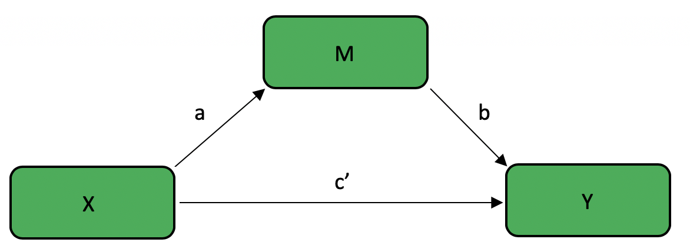

# Bootstrapped Mediation Tutorial

**Author: Jeff Kravtiz**

This tutorial will a) review the concepts of mediation, moderation, and bootstrapping; b) demonstrate how to complete bootsrapped mediation analyses in R; and c) generate hypothetical datasets to explore various possible outcomes.  

## Mediation, Moderation, and Bootstrapping

Basic statistical analyses like ANOVAs allow us to test the effect of one variable on another. However, we often want to go beyond testing these simple relationships to examine more complex relationships, allowing us to test theoretically rich ideas. Mediation and Moderation analyses are two commonly used statisitcal techniques that allow us to explore these complex relationships.  

### Mediation - Overview

Mediation analyses help us examine the **mechanism** of the relationship between two variables. This technique answers the question of *how* variables are related. A mediator variable **explains the relationship** between an independent variable and a dependent variable.  

For example, consider a case in which we know that mindfulness meditation increases happiness in people. Although there is clear evidence that mindfulness increases happiness, research has not yet explored why this is the case. Suppose that we think that mindfulness decreases stress, which in turn increases happiness. In other words, we think that mindfulness only indirectly affects happiness *by means of* reducing stress.  

### Moderation - Overview

Moderation analyses help us examine the **conditions** in which two variables are related. This technique answers the question of *when* variables are related. A moderator variable **affects the strength and/or direction** of the relationship between an independent variable and a dependent variable.  

Consider again the above case in which  we know that mindfulness meditation increases happiness in people. Various studies examine this effect, and while most studies produce positive findings, some produce null findings. We suspect that there certain situations in which mindfulness does not increase happiness. Specifically, we hypothesize that mindfulness can only function properly when people have a sufficient attention span. In other words, we expect that the effect of mindfulness on happiness *depends on* an individual's attention span.  

### Bootstrapping

Bootstrapping is a statistical method that utilizes random resampling with replacement to estimate a population parameter. This technique samples from a given dataset to estimate a parameter when it would otherwise be impossible or impractical to do so. In this way, the dataset is treated as the population, and each random sample aims to replicate a potential score within the true population. The amount of samples varies, but usually falls between 1,000 and 10,000.  

One advantage of the bootstrap method is that it produces confidence intervals for your statisitcal estimate. This gives us valuable information of the likely value of a parameter, whereas a *p* value simply gives us a single number that estimate the likelihood of our statistic assuming that the null is true.  

## Mediation - Effects

The purpose of mediation analyses is to determine if the effect of an independent variable (X) on a dependent variable (Y) can be explained by a mediating variable (M). This can be visualized in the following figure:

{width=70%}

<br />  

There are various different effects to consider when conducting a mediation analysis.

* The **total effect** is the total effect of X on Y, with no consideration of mediator variables. This is also known as the **c path**  

{width=70%}

<br />  

* The **direct effect** is the effect of X on Y after removing the contribution of M. This is known as the **c' path**   

* The effect of X on M is known as the **a path**

* The effect of M on Y is known as the **b path**

* The **indirect effect** is the effect of X on Y *through M*. This is equivalent to the product of the a path and the b path, sometimes known as the **ab path**  
    
{width=70%}

<br />  

## Bootstrapped Mediation in R

This tutorial demonstrates how to conduct bootstrapped mediation analyses using the `mediate` function in  the `mediation` package. As such, the first step is to install and load the `mediation` package.

```{r eval=FALSE}

install.packages("mediation")
library(mediation)

```

### Structure

In this section, I will first introduce and then breakdown the structure of mediation using the `mediate` function. The basic structure is as follows:

```{r eval=FALSE}

X <-
Y <-
M <-


model.m <- lm(M ~ X)
model.y <- lm(Y ~ X + M)

library(mediation)
mediation_results <- mediate(model.m = model.m,
                       model.y = model.y,
                       sims = 
                       boot = TRUE,
                       mediator = "  ",
                       treat = "  ")
summary(mediation_results)

```

### Defining Variables

The next step in mediation is defining your variables. As I mentioned earlier, X will denote the independent variable; Y will denote the dependent variable; and M will denote the mediator variable. We will assign X, Y, and M to be vectors of equal length representing participants' scores on each of these variables.  

```{r eval=FALSE}

X <-
Y <-
M <-
  
```

In order to demonstrate a practical example, let us revisit the aforementioned example in which we want to investigate whether mindfulness increases happiness by decreasing stress. Suppose that we have one randomly-assigned, between-subjects independent variable of mindfulness training, with one experimental condition in which 50 participants practice mindfulness meditation for 20 minutes (dummy coded 1), and one control condition in which 50 participants close their eyes for 20 minutes (dummy coded 0). We measure both stress levels and happiness, each on a 1 - 7 likert scale, where 7 indicates minimum stress or maximum happiness. 

```{r}

X_mindfulness <- c(rep(0,50),rep(1,50))
Y_happiness <- runif(100, min = 1, max = 7)
M_stress  <- runif(100, min = 1, max = 7)

```

### Defining Models

To use the `mediate` function, we must first define two linear models:  

* `model.m`, predicting M from X

* `model.y`, predicting Y from X and M

```{r eval=FALSE}

model.m <- lm(M ~ X)
model.y <- lm(Y ~ X + M)

```

In our example, it would look like this:

```{r}

model.m <- lm(M_stress ~ X_mindfulness)
model.y <- lm(Y_happiness ~ X_mindfulness + M_stress)

```

### Mediate

Next, we call the `mediate` function with the following arguments:

* `model.m` = `model.m`
  
* `model.y` = `model.y`
  
* `sims` = *the number of resamples that you want to use*
  
* `boot` = `TRUE`
  
* `mediator` = *your mediator variable, **in quotes** *
  
* `treat` = *your independent variable, **in quotes** *

```{r eval=FALSE}

mediation_results <- mediate(model.m = model.m,
                       model.y = model.y,
                       sims = 
                       boot = TRUE,
                       mediator = "  ",
                       treat = "  ")
summary(mediation_results)

```

In our example, it would look like this:

```{r eval=FALSE}

full_mediation <- mediate(model.m = model.m,
                       model.y = model.y,
                       sims = 500,
                       boot = TRUE,
                       mediator = "M_stress",
                       treat = "X_mindfulness")
summary(full_mediation)

```

## Generating Datasets to Interpret Outcomes

Because there are various possible outcomes of a mediation analysis, it is useful to generate datasets to model and interpret each outcome. The possible results of a mediation analysis include a) full mediation, in which the effect of the independent variable on the dependent variable is completely explained by the mediator variable; b) partial mediation, in which in which the effect of the independent variable on the dependent variable is partially explained by the mediator variable, but the independent variable still has some direct effect on the dependent variable; and c) no mediation.  

Let's first look at the results of our running example:

```{r eval=FALSE}

summary(mediation_results)

```

```{r echo=FALSE}

X_mindfulness <- c(rep(0,50),rep(1,50))
Y_happiness <- runif(100, min = 1, max = 7)
M_stress  <- runif(100, min = 1, max = 7)

model.m <- lm(M_stress ~ X_mindfulness)
model.y <- lm(Y_happiness ~ X_mindfulness + M_stress)

library(mediation)
mediation_results <- mediate(model.m = model.m,
                       model.y = model.y,
                       sims = 500,
                       boot = TRUE,
                       mediator = "M_stress",
                       treat = "X_mindfulness")
summary(mediation_results)

```

* `ACME` is the Average Causal Mediation Effect, or the **indirect effect** (ab path)

* `ADE` is the Average Direct Effect, or the **direct effect** (c' path)

* `Total Effect` is the **total effect** (c path)

* Our output also gives us confidence intervals and *p* values for each of these effects

Because this data was generated randomly, it is likely that none of the effects are significant. If we impose a structure on our data when generating our example datasets, we can examine each of the possible outcomes of mediation.  

### Full Mediation

In the case of full mediation, the relationship between mindfulness (X) and happiness (Y) is completely explained by stress (M). 

```{r}

# Full Mediation

X_mindfulness <- c(rep(0,50),rep(1,50))
Y_happiness <- c(rep(3,25),rep(4,25),rep(5,25),rep(6,25))
M_stress  <- c(rep(3,25),rep(4,25),rep(5,25),rep(6,25))

model.m <- lm(M_stress ~ X_mindfulness)
model.y <- lm(Y_happiness ~ X_mindfulness + M_stress)

library(mediation)
full_mediation <- mediate(model.m = model.m,
                       model.y = model.y,
                       sims = 500,
                       boot = TRUE,
                       mediator = "M_stress",
                       treat = "X_mindfulness")
summary(full_mediation)

```

In this case, we know we have a full mediation because we have a significant total effect and indirect effect (ACME), but not a direct effect (ADE). The significant total effect tells us that X affects Y. The significant indirect effect tells us that there was a mediating effect of M. The non-significant direct effect tells us that all of the effect of X on Y was explained by M, showing a full mediation.  

### Partial Mediation

```{r}
# Partial Mediation

X_mindfulness <- c(rep(0,50), rep(1,50))
Y_happiness <- c(rep(3,25), rep(4,25), rep(5,25), rep(6,25))
M_stress  <- c(rnorm(25,3,1), rnorm(25,4,1), rnorm(25,5,1), rnorm(25,6,1))


model.m <- lm(M_stress ~ X_mindfulness)
model.y <- lm(Y_happiness ~ X_mindfulness + M_stress)

library(mediation)
partial_mediation <- mediate(model.m = model.m,
                       model.y = model.y,
                       sims = 500,
                       boot = TRUE,
                       mediator = "M_stress",
                       treat = "X_mindfulness")
summary(partial_mediation)
```

Here we know we have a partial mediation because we have a significant total effect, indirect effect (ACME), and direct effect (ADE). The significant total effect tells us that X affects Y. The significant indirect effect tells us that there was a mediating effect of M. The significant direct effect tells us that although there was a mediating effect of M, there was still a direct relationship between X and Y, showing a partial mediation.  

### No Mediation

```{r}
# No Mediation

X_mindfulness <- c(rep(0,50), rep(1,50))
Y_happiness <- c(rep(3,25), rep(4,25), rep(5,25), rep(6,25))
M_stress  <- runif(100, min = 1, max = 7)

model.m <- lm(M_stress ~ X_mindfulness)
model.y <- lm(Y_happiness ~ X_mindfulness + M_stress)

library(mediation)
no_mediation <- mediate(model.m = model.m,
                       model.y = model.y,
                       sims = 500,
                       boot = TRUE,
                       mediator = "M_stress",
                       treat = "X_mindfulness")
summary(no_mediation)
```

Here we know we have no mediation because we have a non-significant indirect effect (ACME), which means that the relationship between X and Y was not at all explained by M.
