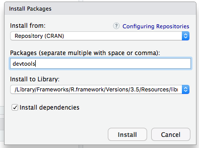

# Creating your own html widget

**Author: Norlander Wilson**

## Overview 

The htmlwidgets package provides a framework for creating R bindings to JavaScript libraries. 

Things to know about HTML Widgets:

-Typically HTMLWIDGETS are used in **Shiny** which is not supported by **.Rmd** however in learning to create your own widget you can essentailly add you widget into **R markdown files**. 

-Used at the R console for data analysis just like conventional R plots.


## What your HTML Widget consist of: 
All widgets include the following components:

-Dependencies. These are the JavaScript and CSS assets used by the widget. 

-R binding. This is the function that the end users will call to provide input data to the widget as well as specify various options for how the widget should render. This also includes some short boilerplate functions required to use the widget within Shiny applications.

-JavaScript binding. This is the JavaScript code that combines *everything**, passing the data and options gathered in the R binding to the underlying JavaScript library.

HTML widgets are always hosted within an R package and should include all of the source code for their dependencies.

## Creating your own HTML Widget. 

**First**. 
**INSTALL THE HTMLWIDGETS PACKAGE**. 
First you will need to find the **packages** tab located on the top left hand corner of the files console; then Click packages; after which, click install; this gives the pop up window shown below:
```{r,echo=FALSE, fig.align='center', out.width=300, fig.height= 300}
knitr::include_graphics("images/FL.png")
```
**Then**
**INSTALL THE DEVTOOLS PACKAGE** 
Following the same procedure above for installing the **HTMLWidgts** package you should also install the **devtools** package, devtools is a dependencey that creates a wrapper for your html widget to be hosted in. 
```{r,echo=FALSE, fig.align='center', out.width=300, fig.height= 300}

```

## Scaffolding 
When creating your own widget you must call the **scaffolding** function to generate the basic stucture for your widget, this is the actual birth of your widget. 
```{r,echo=FALSE, fig.align='center', out.width=1000, fig.height= 1000}
knitr::include_graphics("images/exc.jpg")
```

## Widget Sizing 
This Contols the size of the widget. A sizing policy is specified for the widget. This is done via the  sizingPolicy argument to the create Widget function. The sizing policy is used by the framework to compute the correct width and height for a widget given where it is being rendered. See image bellow for demo. 

```{r,echo=FALSE, fig.align='center', out.width=750, fig.height= 750}

```


## Demo

The below function demonstrates a downloading app for ebola statistics in specific countries. This is a demonstration of an **Rmd File** hosting a **Shiny App/Widget**. You will find that I followed the step above and I am now able to embed widgets into my APA papers.

```{r, eval=F}
#' @export
DownloadingEbolaDataOutput <- function(outputId, width = "100%", height = "400px") {
  htmlwidgets::shinyWidgetOutput(outputId, "Downloading Ebola Data", width, height, package = "Downloading Ebola Data")
}
#' @export
renderDownloadingEbolaData<- function(expr, env = parent.frame(), quoted = FALSE) {
  if (!quoted) { expr <- substitute(expr) } # force quoted
  htmlwidgets::shinyRenderWidget(expr, DownloadingEbolaDataOutput, env, quoted = TRUE)
}
library(shiny)
ui <- fluidPage(
  
  # App title ----
  titlePanel("Downloading Ebola Data"),
  
  # Sidebar layout with input and output definitions ----
  sidebarLayout(
    
    # Sidebar panel for inputs ----
    sidebarPanel(
      
      # Input: Choose dataset ----
      selectInput("dataset", "Choose a dataset:",
                  choices = c("Ebola Sudan","Ebola Zaire", "Ebola Bundibugyo" )),
      
      # Button
      downloadButton("downloadData", "Download")
      
    ),
    
    # Main panel for displaying outputs ----
    mainPanel(
      
      dataTableOutput("table")
      
    )
    
  )
)

# Define server logic to display and download selected file ----
server <- function(input, output) {
  
  # Reactive value for selected dataset ----
  datasetInput <- reactive({
    df <- fread("dataset.csv")
    df <- df %>%
            filter(Virus == input$dataset)
    return(df)
  })
  
  # Table of selected dataset ----
  output$table <- renderDataTable({
    datasetInput()
  })
  
  # Downloadable csv of selected dataset ----
  output$downloadData <- downloadHandler(
    filename= function() {
      paste(input$dataset, ".csv", sep = "")
    },
    content = function(file) {
      write.csv(datasetInput(), file, row.names = FALSE)
    }
  )
}
shinyApp(ui = ui, server = server)

 

```

## References

- Package ‘htmlwidgets’:https://cran.r-project.org/web/packages/htmlwidgets/htmlwidgets.pdf

-  Develop_intro.Rmd:https://github.com/ramnathv/htmlwidgets/blob/master/vignettes/develop_intro.Rmd

- htmlwidgets for R: https://www.htmlwidgets.org/


